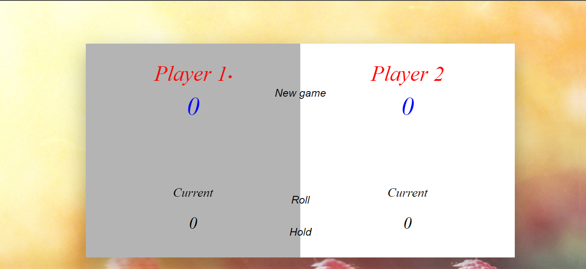
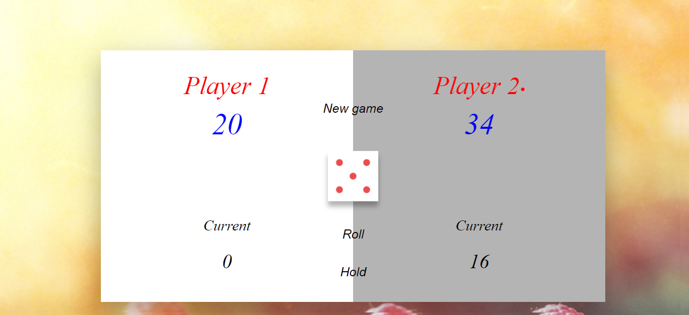
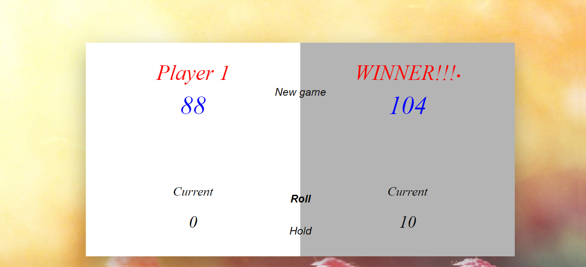

# Pig-Game

This is a web app build using HTML, CSS and JAVASCRIPT.

This project consists of only frontend.

I have used HTML for designing the layout of the game
CSS is used to add colors to the game
JavaScript is used to add functionality to the app like button press, dice show/hide, score calculation.

## About the GAME
This game can be played by 2 users.
First the user need to input the high score which they want to end the game
First user will get the turn and he can either <b>ROLL</b> or <b>HOLD</b> the score.
If the player rolles then the dice will be rolled and a random number between 1 to 6 will appear

All the current score will be stored in current.

When the player will hit <b>HOLD</b> then current value will be added to final score and the turn of dice will be given to other player

If the player gets 1 as the number then his/her current score will turn zero and the turn of dice will be given to other player.

First person to reach the maximum score wins the game!!!

As soon as a players wins the game then no-one can roll the dice.

Players can rematch using <b>NEW GAME</b> button

### THANK YOU!!!
